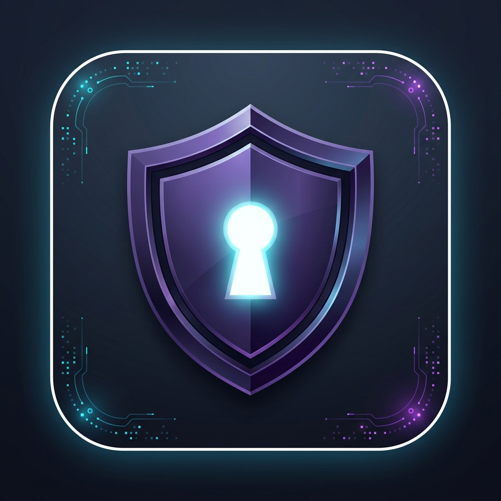
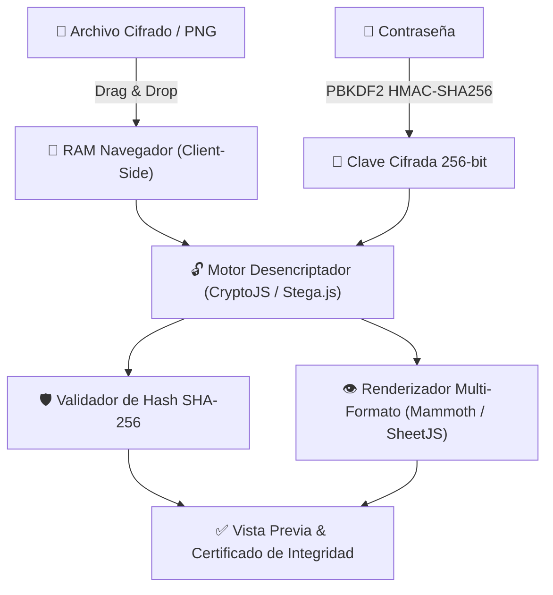

# 🛡️ StegaVault Enterprise Web App (PWA)
> **Sistema Web Empresarial de Ciberseguridad, Esteganografía LSB, Cifrado Criptográfico y Certificación de Integridad SHA-256**

---

## 🌟 Visión General del Sistema

**StegaVault Enterprise Web App** es una plataforma web progresiva (PWA) de alta seguridad diseñada para la extracción, desencriptación y previsualización multi-formato de datos confidenciales camuflados mediante esteganografía o cifrados con estándares criptográficos militares.

Toda la computación criptográfica, derivación de claves y renderizado de documentos ocurre **100% en la memoria RAM del navegador del usuario (Client-Side)**. Ningún archivo, mensaje o contraseña es transmitido hacia ningún servidor externo.

---

## ⚡ Características Principales

* 🔒 **Desencriptación Universal Drag & Drop:** Arrastra cualquier imagen PNG esteganográfica, documento PDF cifrado o archivo de ofimática (Word `.docx`, Excel `.xlsx`, PowerPoint `.pptx`).
* 👁️ **Vista Previa Directa Multi-Formato:** Renderiza nativamente en pantalla el contenido extraído:
  * 📝 **Word (`.docx`):** Conversión dinámica a HTML estructurado.
  * 📊 **Excel (`.xlsx` / `.csv`):** Hojas de cálculo interactivas con navegación por pestañas de hojas.
  * 📕 **PDF (`.pdf`):** Visor PDF integrado.
  * 🖼️ **Imágenes y Texto (`.png`, `.jpg`, `.txt`, `.json`, `.pem`):** Visualización directa en pantalla.
* 🛡️ **Certificación de Integridad SHA-256:** Cálculo automático del hash criptográfico de 256 bits para auditar la autenticidad e inalterabilidad de los archivos recuperados.
* 📲 **Aplicación Web Progresiva (PWA) 100% Offline:** Instalable con un clic en smartphones (Android / iOS) y computadoras de escritorio. Funciona sin conexión a internet mediante Service Workers de caché de alto rendimiento.
* 🔊 **Feedback Auditivo Sintetizado:** Efectos sonoros generados dinámicamente mediante la **Web Audio API** para confirmar operaciones exitosas, errores y copias de seguridad.
* 📜 **Historial de Auditoría Local con Buscador:** Registro interactivo de operaciones en sesión con filtros dinámicos por nombre, tipo de archivo o fecha.

---

## 🛠️ Tecnologías y Librerías Utilizadas

El proyecto fue desarrollado utilizando estándares web modernos con enfoque en rendimiento nativo y cero dependencias pesadas:

| Componente | Tecnología / Librería | Descripción |
| :--- | :--- | :--- |
| **Estructura Core** | HTML5 Semántico + ES6+ JS | Lógica modular en arquitectura limpia de alto rendimiento |
| **Estilos & UI** | Vanilla CSS3 Custom Tokens | Tema oscuro enterprise con Glassmorphism y animaciones fluídas |
| **Cifrado & Hash** | Web Crypto API + CryptoJS | Algoritmos **AES-256**, **PBKDF2 HMAC-SHA256** (480,000 iteraciones) y **SHA-256** |
| **Esteganografía** | Custom LSB Engine (`stega.js`) | Extracción de paquetes binarios inyectados en capas LSB de píxeles PNG |
| **Render de Word** | `Mammoth.js` (`mammoth.browser.min.js`) | Conversión de estructuras OpenXML `.docx` a HTML estilizado |
| **Render de Excel** | `SheetJS` (`xlsx.full.min.js`) | Parseo de libros de trabajo `.xlsx` y exportación a tablas interactivas |
| **Audio Engine** | Web Audio API Oscillator | Sintetizador de tonos y micro-interacciones sonoras sin archivos de audio externos |
| **Offline & PWA** | Service Worker + Web App Manifest | Caching *Stale-While-Revalidate* para ejecución instantánea sin internet |

---

## 🔐 Arquitectura de Seguridad (Zero-Trust)

> [!IMPORTANT]
> **Privacidad Absoluta:** La plataforma opera bajo el modelo **Zero-Knowledge Architecture**. Los datos confidenciales permanecen exclusivamente en el dispositivo del cliente.

---

## 📖 Formatos Soportados

| Categoria | Extensiones Soportadas |
| :--- | :--- |
| **Imágenes Esteganográficas** | `.png` (Imágenes con datos adjuntos o texto inyectado en LSB) |
| **Documentos de Ofimática** | `.docx`, `.xlsx`, `.pptx` (Cifrado nativo AES-256) |
| **Documentos PDF** | `.pdf` (Cifrado estándar de documento) |
| **Archivos Adjuntos Recuperables** | `.zip`, `.pdf`, `.txt`, `.json`, `.pem`, `.jpg`, `.csv`, etc. |

---

## 🌐 Enlace de Despliegue Oficial

Accede a la aplicación en vivo e instálala en tu dispositivo:
👉 **[https://stivenrc.github.io/stegavault-web/](https://stivenrc.github.io/stegavault-web/)**

---
*StegaVault Enterprise Web App v2.0 • Plataforma Abierta de Ciberseguridad & Esteganografía*
